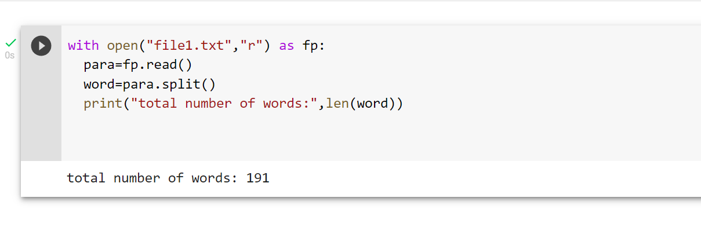
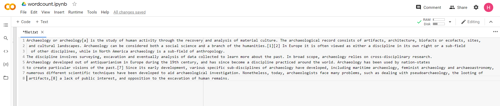

# Word-count
## AIM:
To write a python program for getting the word count from a text.
## EQUIPEMENT'S REQUIRED: 
PC
Anaconda - Python 3.7
## ALGORITHM: 
### Step 1:
open file1.txt as fp
### Step 2: 
 add content to the file1.txt file
### Step 3: 
use read mode to read the file1.txt
### Step 4:  
split the words in the file using split()
### Step 5: 
use len(word) to find total number of words
### Step 6: 
print the output
## PROGRAM:
```
with open("file1.txt","r") as fp:
  para=fp.read()
  word=para.split()
  print("total number of words:",len(word))
  
```  
### OUTPUT:

###  INPUT file1.txt



## RESULT:
Thus the program is written to find the word count from a text.
